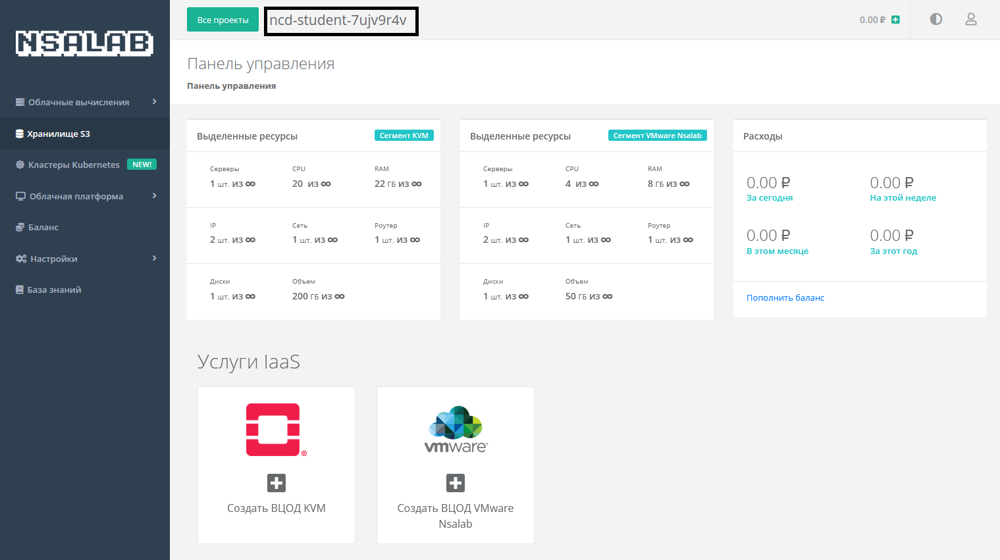
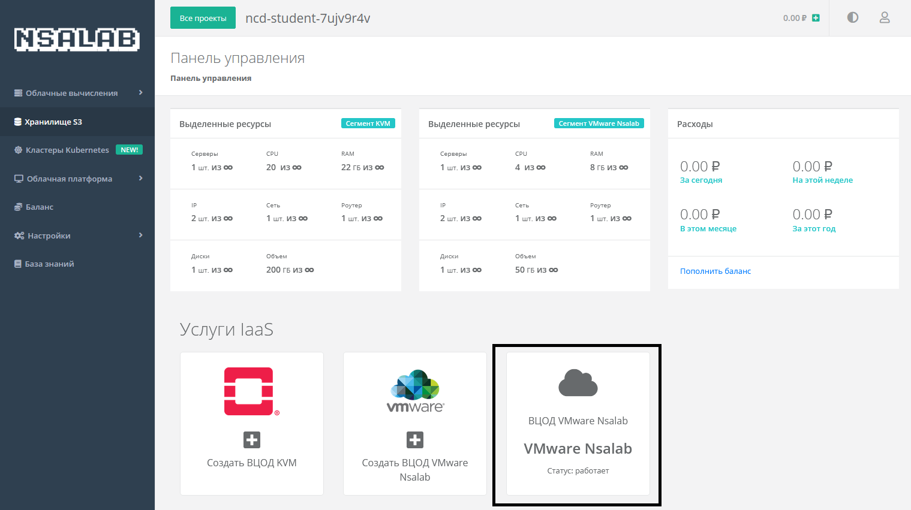

# Конкурсное задание

## Обзор панели управления

Войдите на портал https://portal.skillscloud.company используя учетную запись и пароль, предоставленные вам в консоли справа.


После входа на портал, в верхней части панели обратите внимание на проект который вам доступен. Проект представляет собой группу ресурсов, куда могут входить виртуальные центры обработки данных, домены, объектные хранилища типа S3, а также кластеры Kubernetes. Попробуйте нажать на **Все проекты** и вы увидите, что вам доступен только один проект. Вернитесь на главную панель нажав **Перейти к проекту**



В разделе **Услуги IaaS** нажмите на **Создать ВЦОД KVM**. Справа появится плитка под названием **ВЦОД KVM**. После того как ВЦОД будет создан, нажмите на него, чтобы перейти к ресурсам.



По умолчанию откроется раздел **Серверы**, где вам будет предложено создать новый сервер. Перед тем как сделать это, перейдите в раздел **Роутеры**. Обратите внимание на то, что для каждого нового ВЦОДа создается сервисный маршрутизатор в сети 10.0.1.0/24 с публичным IP-адресом (при условии, что для вашего проекта разрешен выход в интернет).


В разделе **Сети** вы можете получить более подробную информацию о созданной автоматически сервисной сети - обратите внимание на диапозон доступных IP-адресов и на включенную опцию автоматической выдачи адресов по протоколу DHCP.


В разделе **Брандмауэр** вы можете ознакомиться с преднастроенными шаблонами фильтрации трафика.


## Создание виртуальной машины

Вернитесь в раздел **Серверы** и нажмите **Создать**. В появившемся окне задайте настройки виртуальной машине согласно следующим параметрам:

| Основные настройки | Значение |
|---|---|
|Имя|EVE-NG|
|Шаблон|Ubuntu 16.04|
|Имя хоста|eve-ng|
|Логин пользователя|ubuntu|
|Пароль|P@ssw0rd|
|Публичный ключ SSH|Без ключа|
|Примечание| |
|Теги| |

|Конфигурация|Значение|
|---|---|
|vCPU|4|
|RAM|8|

|Диски|Значение|
|---|---|
|Основной диск|50 ГБ|

|Подключения|Значение
|---|---|
|Публичный IP|Случайный|
|Сеть|Автоматически|
|Брандмауэр|По-умолчанию, Разрешить WEB, Разрешить SSH, Разрешить ICMP


Нажмите **Создать**. Вы вернетесь в раздел **Серверы**, где будет виден процесс создания виртуальной машины. Дождитесь пока индикатор машины слева станет зеленым. После того, как виртуальная машина будет создана, в правой панели **Действия** выберите **Открыть консоль**.


## Установка EVE-NG

В открывшейся NoVNC консоли, войдите под учетной записью ```ubuntu:P@ssw0rd```. С помощью команды ``sudo su ``продолжите работу как пользователь ```root```. Поменяйте пароль для учетной записи root c помощью команды passwd, задайте пароль ```P@ssw0rd```.


Выполните команду ``wget -O - http://www.eve-ng.net/repo/install-eve.sh | bash -i`` и после завершения скрипта выполните комманду ``reboot``. После перезагрузки войдите под учетной записью ```root:P@ssw0rd``` и следуйте инструкциям конфигуратора. Введите пароль ```P@ssw0rd``` для пользователя ```root```, остальные параметры оставьте по-умолчанию. После завершения работы конфигуратора вернитесь в раздел **Серверы** панели управления, скопируйте внешний IP-адрес виртуальной машины и подключитесь к ней по SSH с помощью вашего локального терминала.


## Подготовка образов для установки виртуальных машин

Перейдите в директорию шаблонов виртуальных машин qemu с помощью команды ``cd /opt/unetlab/addons/qemu/``. С помощью утилиты ``mkdir`` создайте следующие директории:

```
root@eve-ng:/opt/unetlab/addons/qemu# mkdir linux-ubuntu20
root@eve-ng:/opt/unetlab/addons/qemu# mkdir linux-centos8
root@eve-ng:/opt/unetlab/addons/qemu# mkdir winserver-2022
root@eve-ng:/opt/unetlab/addons/qemu# mkdir vyos-1.4
```

Скачайте установочные образы для каждой операционной системы используя следующие комменды:

```
wget -O - https://s3.amazonaws.com/s3-us.vyos.io/rolling/current/vyos-1.4-rolling-202204100814-amd64.iso > vyos-1.4/cdrom.iso
wget -O - https://mirror.yandex.ru/ubuntu-releases/20.04/ubuntu-20.04.4-desktop-amd64.iso > linux-ubuntu20/cdrom.iso
wget -O - https://mirror.yandex.ru/centos/8-stream/isos/x86_64/CentOS-Stream-8-x86_64-20220406-dvd1.iso > linux-centos8/cdrom.iso
wget -O - https://software-download.microsoft.com/download/sg/20348.1.210507-1500.fe_release_SERVER_EVAL_x64FRE_en-us.iso > winserver-2022/cdrom.iso
```

Создайте виртуальные диски для эмулятора qemu-kvm в формате qcow2 для каждого шаблона виртуальной машины с использованием следующих комманд:

```
root@eve-ng:/opt/unetlab/addons/qemu# qemu-img create -f qcow2 vyos-1.4/virtioa.qcow2 5G
Formatting 'vyos-1.4/virtioa.qcow2', fmt=qcow2 size=5368709120 encryption=off cluster_size=65536 lazy_refcounts=off refcount_bits=16

root@eve-ng:/opt/unetlab/addons/qemu# qemu-img create -f qcow2 linux-ubuntu20/virtioa.qcow2 15G
Formatting 'linux-ubuntu20/virtioa.qcow2', fmt=qcow2 size=16106127360 encryption=off cluster_size=65536 lazy_refcounts=off refcount_bits=16

root@eve-ng:/opt/unetlab/addons/qemu# qemu-img create -f qcow2 linux-centos8/virtioa.qcow2 15G
Formatting 'linux-centos8/virtioa.qcow2', fmt=qcow2 size=16106127360 encryption=off cluster_size=65536 lazy_refcounts=off refcount_bits=16

root@eve-ng:/opt/unetlab/addons/qemu# qemu-img create -f qcow2 winserver-2022/virtioa.qcow2 20G
Formatting 'winserver-2022/virtioa.qcow2', fmt=qcow2 size=21474836480 encryption=off cluster_size=65536 lazy_refcounts=off refcount_bits=16
```

Подробнее ознакомиться с форматом наименований виртуальных дисков можно на сайте eve-ng по ссылке: https://www.eve-ng.net/index.php/documentation/qemu-image-namings/ 

## Настройка NAT интерфейса

После установки eve-ng для всех интерфейсов операционой системы были созданы виртуальные бриджи ```pnet*```. Интерфейс pnet0 является бриджом для интерфейса ```eth0``` и используется для управления и подклчючения виртуальных машин к сети управления.

Для того, чтобы виртуальные машины имели возможность выходить в сеть интернет, настройте адрес ``10.0.138.1/24`` на интерфейсе ```pnet1``` используя команду ```ifconfig``` и проверте результат, как показано ниже:

```
root@eve-ng:/opt/unetlab/addons/qemu# ifconfig pnet1 10.0.138.1/24

root@eve-ng:/opt/unetlab/addons/qemu# ifconfig pnet1
pnet1     Link encap:Ethernet  HWaddr 06:99:49:d2:4b:63
          inet addr:10.0.138.1  Bcast:10.0.138.255  Mask:255.255.255.0
          inet6 addr: fe80::499:49ff:fed2:4b63/64 Scope:Link
          UP BROADCAST RUNNING MULTICAST  MTU:1500  Metric:1
          RX packets:0 errors:0 dropped:0 overruns:0 frame:0
          TX packets:15 errors:0 dropped:0 overruns:0 carrier:0
          collisions:0 txqueuelen:1000
          RX bytes:0 (0.0 B)  TX bytes:1146 (1.1 KB)
```

Добавьте правило ```iptables``` для трансляции сетевых адресов из сети ``10.0.138.0/24`` в адрес интерфейса ```pnet0``` и проверьте результат с помощью следующих комманд:


```
root@eve-ng:/opt/unetlab/addons/qemu# iptables -t nat -A POSTROUTING -s 10.0.138.0/24 -o pnet0 -j MASQUERADE

root@eve-ng:/opt/unetlab/addons/qemu# iptables -t nat -L

Chain PREROUTING (policy ACCEPT)
target     prot opt source               destination

Chain INPUT (policy ACCEPT)
target     prot opt source               destination

Chain OUTPUT (policy ACCEPT)
target     prot opt source               destination

Chain POSTROUTING (policy ACCEPT)
target     prot opt source               destination
MASQUERADE  all  --  10.0.138.0/24        anywhere
```

Разрешите маршрутизацию пакетов используя следующие команды:

```
root@eve-ng:/opt/unetlab/addons/qemu# echo net.ipv4.ip_forward=1 >> /etc/sysctl.conf
root@eve-ng:/opt/unetlab/addons/qemu# sysctl -p
```

## Создание виртуальных машин в EVE-NG

Перейдите по внешнему адресу виртуальной машины в новой вкладке браузера, чтобы открыть веб-консоль EVE-NG. Для входа используйте учетную запись ``admin:eve``. Также выберите опцию HTML5 console, чтобы получать доступ к консолям виртуальных машин с помощью браузера.


После входа, создайте новую лабораторную работу, назовите ее ``ncd-eve-test``.


Нажмите правой клавишей мыши на свободной области экрана, в меню **Add a new object** выберите **Node**. В открывшемся меню выберите **Linux**. Обратите внимание, что **Linux** - это общий шаблон виртуальной машины - вы можете выбрать конкретный образ **CentOS** или **Ubuntu** в выподающем списке **Images**. Аналогично выбираются шаблоны и образы для виртуальных машин других типов операционных систем. При добавлении узла в данном меню можно указать параметры виртуальной машины. Добавьте 4 виртуальных машины со следующими параметрами:


|Image|Name|CPU|RAM|
|---|---|---|---|
|linux-ubuntu20|Ubuntu|1|1024MB|
|linux-centos8|CentOS|1|1024MB|
|winserver-2022|Windows Server|2|2048MB|
|vyos-1.4|VyOS|1|1024MB|

Добавьте виртуальный NAT-бридж. В меню **Add a new object** выберите **Network**. В выпадающем списке Type выберите **Cloud1** - данный бридж соответствует виртуальному интерфейсу **pnet1**, спомощью которого вы ранее настроили трансляцию сетевых адресов.


Подсоедините все виртуальные машины к созданному виртуальному бриджу, выделите все машины, нажмите правой клавишей мыши по одной из виртуальных машин и в контекстном меню выберите **Start Selected**.


После того, как пиктограммы сменят цвет, нажмите на каждую левой кнопкой мыши, чтобы открыть HTML5 консоль каждой виртуальной машины. Произведите установку операционных систем Windows Server и CentOS. 

В качестве режима для установки Windows Server выберите Standard Evaluation (Desktop Experience). В процессе установки необходимо загрузить драйвер для дисковой подсистемы, который находится на диске B:\.


В качестве режима установки для CentOS выберите **Server** (без GUI).

В процессе установки выберите опцию **Try Ubuntu**, чтобы сразу загрузить операционную систему без установки.

Образ VyOS загружается сразу в оперативную память виртуальной машины, установка не требуется. Учетная запись по-умолчанию ```vyos:vyos```.

## Настройка сети и проверка связности

На виртуальной машине VyOS выполните следующие команды для настройки IP-адреса:

```
vyos@vyos:~$ configure 
vyos@vyos# set interfaces ethernet eth0 address 10.0.138.11/24
vyos@vyos# commit
```

Настройте маршрут по умолчанию с указанием адреса интерфейса pnet1 в качестве шлюза:

```
vyos@vyos# set protocols static route 0.0.0.0/0 next-hop 10.0.138.1
vyos@vyos# commit
```

Проверьте примененную конфигурацию:

```
vyos@vyos# show interfaces 
 ethernet eth0 {
     address 10.0.138.11/24
     hw-id 50:00:00:04:00:00
 }
 ethernet eth1 {
     hw-id 50:00:00:04:00:01
 }
 ethernet eth2 {
     hw-id 50:00:00:04:00:02
 }
 ethernet eth3 {
     hw-id 50:00:00:04:00:03
 }
 loopback lo {
 }
[edit]
vyos@vyos# show protocols 
 static {
     route 0.0.0.0/0 {
         next-hop 10.0.138.1 {
         }
     }
 }
[edit]
vyos@vyos# 
```

Проверьте связность до адреса 8.8.8.8:

```
vyos@vyos# ping 8.8.8.8
PING 8.8.8.8 (8.8.8.8) 56(84) bytes of data.
64 bytes from 8.8.8.8: icmp_seq=1 ttl=101 time=15.3 ms
64 bytes from 8.8.8.8: icmp_seq=2 ttl=101 time=15.0 ms
^C
--- 8.8.8.8 ping statistics ---
2 packets transmitted, 2 received, 0% packet loss, time 1002ms
rtt min/avg/max/mdev = 14.976/15.157/15.338/0.181 ms
```

В терминале виртуальной машины Ubuntu выполните следующие команды:

```
ubuntu@ubuntu:~$ sudo ip address add 10.0.138.12/24 dev ens3
ubuntu@ubuntu:~$ sudo ip route add 0.0.0.0/0 via 10.0.138.1
```

Проверьте связность до адреса 8.8.8.8:

```
ubuntu@ubuntu:~$ ping 8.8.8.8
PING 8.8.8.8 (8.8.8.8) 56(84) bytes of data.
64 bytes from 8.8.8.8: icmp_seq=1 ttl=101 time=15.3 ms
64 bytes from 8.8.8.8: icmp_seq=2 ttl=101 time=15.0 ms
^C
--- 8.8.8.8 ping statistics ---
2 packets transmitted, 2 received, 0% packet loss, time 1002ms
rtt min/avg/max/mdev = 14.976/15.157/15.338/0.181 ms
```

На виртуальной машине CentOS выполните следующие команды:

```
[root@localhost ~]# ifconfig ens3 10.0.138.13/24
[root@localhost ~]# ip route add 0.0.0.0/0 via 10.0.138.1
```

Проверьте связность до адреса 8.8.8.8:

```
[root@localhost ~]# ping 8.8.8.8
PING 8.8.8.8 (8.8.8.8) 56(84) bytes of data.
64 bytes from 8.8.8.8: icmp_seq=1 ttl=101 time=15.3 ms
64 bytes from 8.8.8.8: icmp_seq=2 ttl=101 time=15.0 ms
^C
--- 8.8.8.8 ping statistics ---
2 packets transmitted, 2 received, 0% packet loss, time 1002ms
rtt min/avg/max/mdev = 14.976/15.157/15.338/0.181 ms
```

Для входа в операционную систему Windows Server через HTML5 консоль необходимо нажать сочетание клавиш Ctrl+Alt+Shift для вызова бокового меню Guacamole. В данной панели необходимо выбрать опцию экранной клавиатуры.


На экранной клавиатуре необходимо нажать сочетание клавиш Ctrl+Alt+Del для вызова окна авторизации. После появления приглашения для ввода пароля, сочетание клавиш на экраной клавиатуре нужно отжать, снова вызвать боковую панель Guacamole сочетанием клавиш Ctrl+Alt+Shift и убрать экранную клавиатуру.


В сетевых настройках установите IP-адрес и проверьте связность до адреса 8.8.8.8.


## Удаление ресурсов 

Вернитесь в панель управления NSALAB Cloud, нажмите на имя виртуальной машины. В открывшемся окне нажмите кнопку **Удалить**. После того, как удаление виртуальной машины завершится, перейдите в раздел настройки и нажмите **Удалить ВЦОД**.